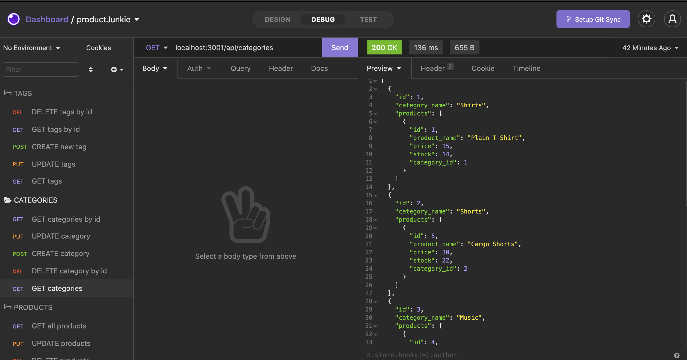

# Product Junkie


## Table of Contents 

- [Description](#description)
- [Installation](#installation)
- [Usage](#usage)
- [Languages](#languages)
- [Screenshots](#screenshots)
- [Demo](#demo)
- [Questions](#questions)

## Description

The back end for an e-commerce site that uses Node, Express.js API, Sequelize, and interacts with a MySQL database. All you need to do is connect your front end to use it!

## Installation

```
// Clone the repository to your local machine using:|

git clone git@github.com:ellysecarter/productJunkie.git

// Install all the dependencies by typing code:
npm i express mysql2 dotenv sequelize

// Ensure you have set up MySQL and you have a legacy password to log in with ****

// Create a .env file in the root of the folder and fill out the following with your information:
DB_NAME='ecommerce_db'
DB_USER='root'
DB_PW='putyourpasswordhere'

// From the db folder, login to your MySQL using either of the following:
mysql -u root -p
/usr/local/mysql/bin/mysql -u root -p


// Then, run this command to create the database:
source schema.sql;

// Then quit the MySQL shell by typing
quit;

// Seed the test data into the database by typing:
npm run seed

// Then use the below command to start the server:
npm start

```

## Usage
Use this application to build on the front end for an e-commerce site to this back end.

## Deployed application link
https://github.com/ellysecarter/productJunkie

## Demo
https://watch.screencastify.com/v/S6xxNMzyo6Yp6qs6ywSP

## Languages/Technology Used
* Node
* Express.js API
* Sequelize 
* MySQL

## Screenshots



## Questions?

If you have any questions or would like to contribute to this project please reach out to me at ellysecarter@yahoo.com or [@ellysecarter](https://github.com/ellysecarter)
